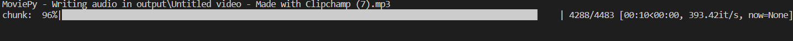

# Audio Extractor from Video

Extract audio from your favorite videos using a simple GUI.

## Details

This project uses the following Python modules:
- `os`
- `moviepy.editor`
- `tkinter`

Before using the script, you should install the required external modules using pip: pip install moviepy tkinter

## Features

- Simple and user-friendly GUI.
- Supports multiple video formats like mp4, avi, mkv, flv, and mov.
- Auto-creation of input and output directories for better file management.
- Flexibility to choose desired audio format.

## Getting Started

1. Clone this repository to your local machine: git clone https://github.com/Bisalkumar/Audio-Extractor.git
2. Navigate to the project directory and install the required modules.
3. Run the script to start the application.

## How to Use

1. Click on the "Select video file" button to choose the desired video.
2. Select the desired audio output format (default is mp3).
3. Wait for the extraction process to complete.
4. Upon successful extraction, you'll receive a success message with the path to the extracted audio file.

## Screenshots

## Contributions

We welcome contributions from the community. If you'd like to contribute:
1. Fork this repository.
2. Create a new branch for your feature or bugfix.
3. Push your changes and create a pull request.

## License

This project is licensed under the MIT License. See [LICENSE](LICENSE) file for details.

## Acknowledgement

- Thanks to the `moviepy` team for the amazing library.
- All contributors and users of this tool.